# **Publicar una libreria o paquete a NPM**

[npm](https://www.npmjs.com/) es como una biblioteca gigante de bloques de construcción de código. Hay toneladas de estos "bloques", también conocidos como "paquetes" que podemos componer juntos para construir cosas geniales. Podemos usar paquetes de otros desarrolladores, pero también podemos escribir y publicar los nuestros.

## Introducción

En este taller aprenderemos a crear, publicar y actualizar nuestros propios paquetes. Crearemos una aplicación por consola que muestre información personal al estilo de una `business card`, incluidas las pruebas. Luego cubriremos la publicación y actualización de nuestro paquete. Este mismo enfoque se puede utilizar para crear y publicar otros tipos de paquetes, como componentes (React, Angular, Web Components, etc.) e interfaces de línea de comandos.

## Requerimientos

- Node.js y npm instalados
- Tener una cuenta creada en [npmjs.com](https://www.npmjs.com/signup) y habilitar la [doble autenticación](https://docs.npmjs.com/configuring-two-factor-authentication)
- Cuenta de [github.com](http://github.com)

## Taller

Vamos a construir una aplicación por consola que muestra la información personal en forma de tarjeta y se va ver similar a esto:

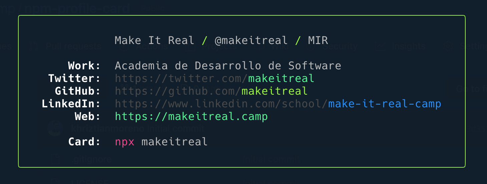

### 1. Crear el repositorio para nuestro paquete npm

Los paquetes npm casi siempre tienen un repositorio git vinculado para el control de versiones. Comenzaremos nuestro paquete inicializando un repositorio git.

Lo primero es ir a [https://github.com/new](https://github.com/new) y crear un nuevo repositorio, el nombre del repositorio puede ser `npm-profile-card` y deberá ser publico.

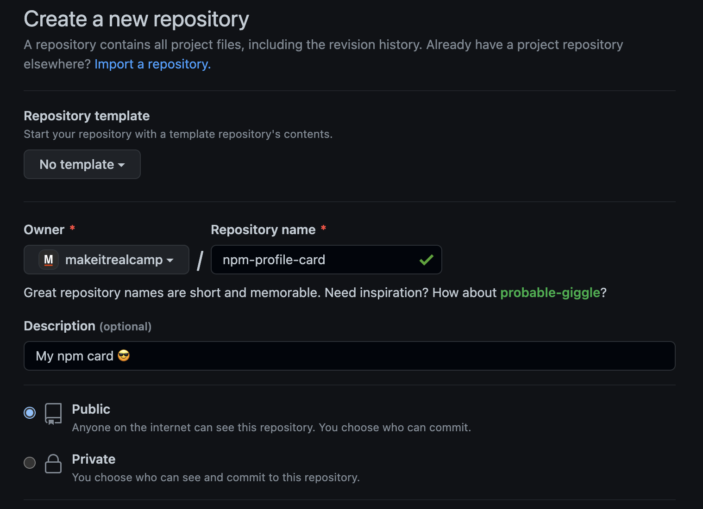

Escogeremos las siguientes opciones extras a nuestro repositorio.

- Iniciarlizar `README.md`
- Agregar `.gitignore` → Node
- Seleccionar una licencia → MIT

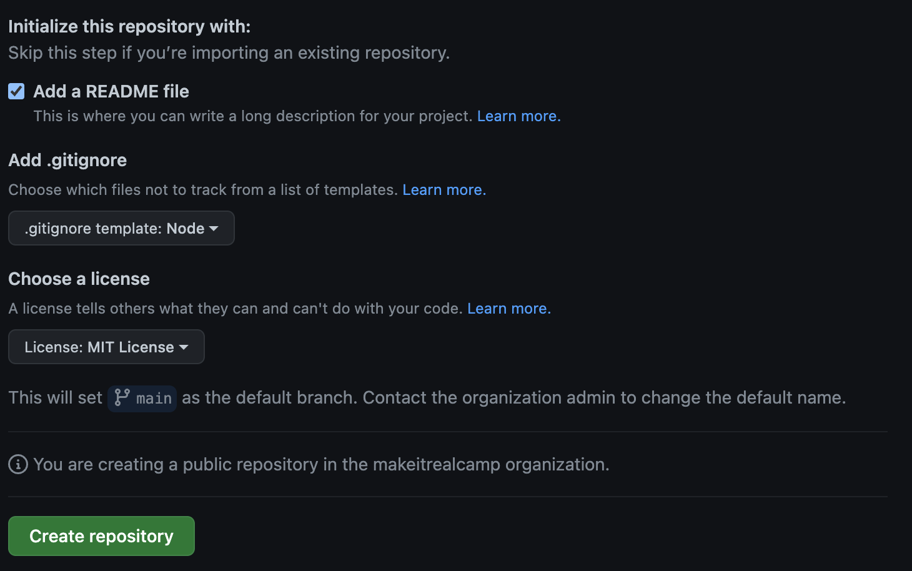

Lo siguiente que vamos a realizar el clonar este repositorio en tu computador:

```bash
git clone git@github.com:username/npm-profile-card.git
```

Finalmente ubicate en dentro de la carpeta del proyecto mediante la terminal

```bash
cd npm-profile-card/
```

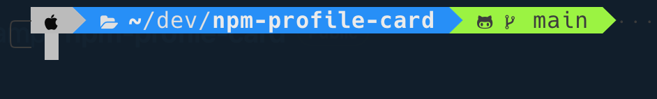

### 2. Estructura y setup del proyecto

Vamos a definir la estructura que llevara nuestro proyecto, sera similar a esta:

```bash
npm-profile-card
├── bin
│    └── card.js
├── .editorconfig
├── .gitignore
├── LICENSE
├── README.md
└── package.json
```

Podemos crear un `package.json` automáticamente ejecutando `npm init` y respondiendo las preguntas que da. Esto se convierte en el archivo "manifiesto" para nuestro paquete; se usa para completar la página npm publicada y también para ayudar al administrador de paquetes a saber cómo instalar el paquete en los proyectos de consumo.

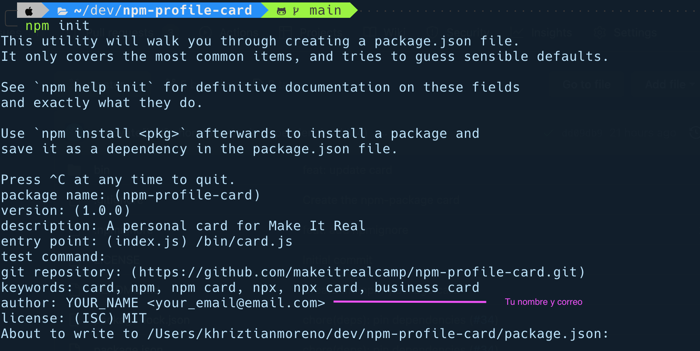

Luego de esto vamos a crear el archivo `card.js` en la carpeta `bin` que tendrá la siguiente información:

```jsx
#!/usr/bin/env node
// 👆 Used to tell Node.js that this is a CLI tool

'use strict'
```

En este archivo lo estaremos modificando en puntos mas adelante.

#### ES Modules

Vamos a definir en el`package.json` el uso de módulos de ES6 para eso solo debemos agregar la siguiente linea dentro del archivo.

```json
"type": "module"
```

- Cuando el archivo `package.json` tiene `"type": "module"`, su código fuente debe usar la sintaxis de importación. Cuando no tenga, debe usar la sintaxis `require`; es decir, agregar al `"type": "module"`  `package.json`  habilita los **módulos ES6.** Mas [info aqui](https://nodejs.org/docs/latest-v13.x/api/esm.html#esm_enabling).


Ahora vamos a decirle al package.json cual va ser el archivo que va ejecutar por defecto y para esto agregamos:

```bash
"bin": {
  "makeitrealcamp": "./bin/card.js"
}
```

donde `makeitrealcamp` es el nombre de tu paquete.

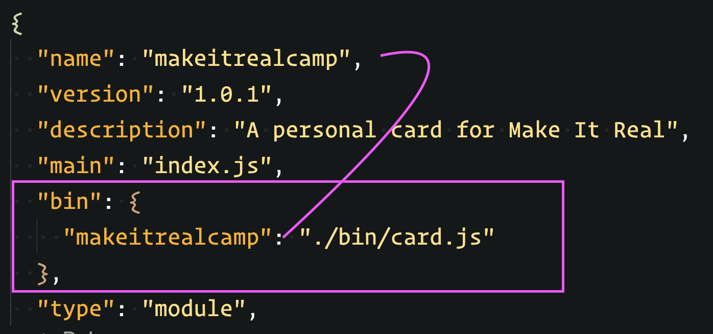

### 3. Dependencias para nuestro proyecto

En este paso vamos a instalar las dependencias que vamos a utilizar incluyendo librerías de testing y linters.

Para esto vamos a la terminal y ejecutamos los siguientes comandos:

```bash
npm install boxen chalk
```

Al final deberas ver estas dependencias agregadas en el `package.json` (*pueden que las versiones no sean las mismas al momento de realizar tu proceso de instalación*)

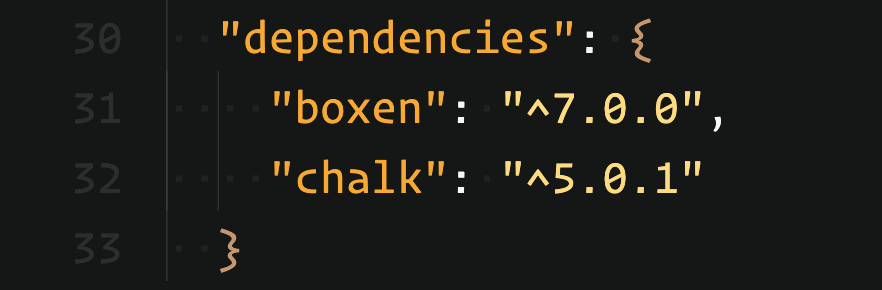

Luego instalamos las dependencias de desarrollo, que nos van a servir para tener un código probado y de buena calidad, entre otras cosas mas.

```bash
npm i -D eslint jest np
```

Comprobamos que estas dependencias se agregaron en nuestro manifiesto:

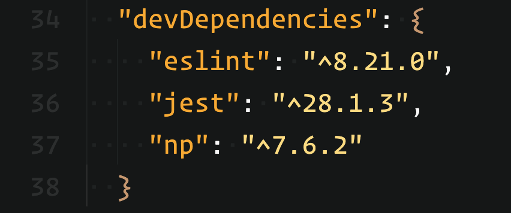

Qué hemos instalado?

- `boxen`: Un paquete para crear cajas en la terminal
- `chalk`: librería para darle estilos a nuestra salida por consola
- `eslint`: herramienta para identificar e informar sobre malos patrones en el código
- `jest`: Runtime para nuestras pruebas
- `np`: Excelente paquete para facilitar el proceso de publicación en npm

**Configurar el linter:**

En la terminal ejecutamos el comando `npx eslint --init` y respondemos a las preguntas que el CLI nos entrega por pantalla, de la siguiente manera:

- `How would you like to use ESLint?` → To check syntax, find problems, and enforce code style
- `What type of modules does your project use?` → CommonJS (require/exports)
- `Which framework does your project use?` → None
- `Does your project use TypeScript?` → No
- `Where does your code run?` → Node
- `How would you like to define a style for your project?` → Use a popular style guide
- `Which style guide do you want to follow?` → Standard: [https://github.com/standard/standard](https://github.com/standard/standard)
- `What format do you want your config file to be in?` → JSON
- `Would you like to install them now with npm?` → YES (*Obvio bobis*)

Al final de estos pasos deberemos tener un archivo en la raiz de nuestro proyecto llamado `.eslintrc.json` y tendrá algo similar a esto:

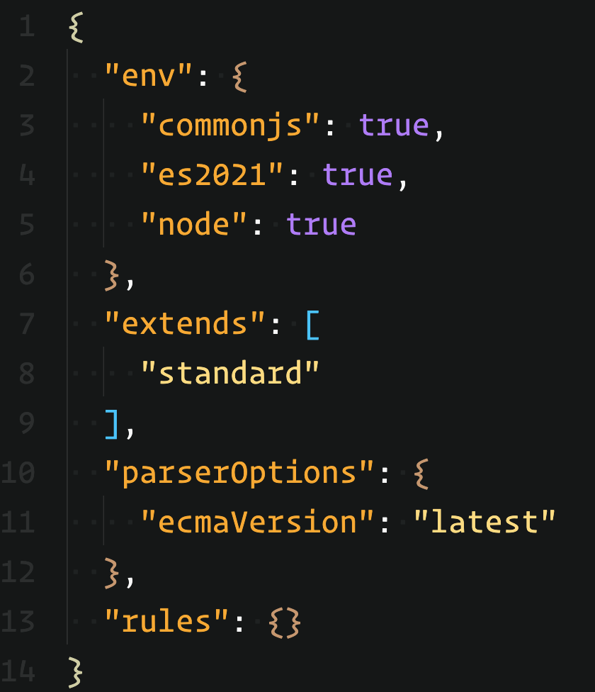

Adicionamos a nuestro manifiesto las siguientes tareas o scripts: (*podemos borrar la tarea `test` por ahora*)

```bash
"scripts": {
   "lint": "eslint --ext .js, bin/card.js",
   "lint:fix": "eslint --ext .js, bin/card.js --fix"
 }
```

### 4. Construir nuestro paquete npm

Dentro del archivo creando en puntos anteriores `bin/card.js` vamos a agregar nuevas lineas de código para construiremos nuestro paquete.

Vamos a importar las dependencias de `chalk` y `boxen`

```jsx
'use strict'

// Pull in our modules
import chalk from 'chalk'
import boxen from 'boxen'
```

Seguidamente crearemos las opciones de configuración que utilizaremos con `boxen`

```jsx
// Define options for Boxen
const options = {
  padding: 1,
  margin: 1,
  borderStyle: 'round'
}
```

Debajo de esto vamos a definir la información que vamos a mostrar en la tarjeta, es decir, nuestra información personal o más importante; para ello vamos ayudarnos del paquete `chalk` que nos permitirá darle algunos estilos a esta data.

Crearemos un objeto `data` con la siguiente información, donde deberas reemplazarla por la tuya.

**IMPORTANTE**: *Mantén los espacios en blanco*

```jsx
// Text + chalk definitions
const data = {
  name: chalk.white('           YOUR_NAME'),
  handle: chalk.white('@YOUR_HANDLE'),
  shorthandle: chalk.white('YOUR_SHORT_HANDLE'),
  work: chalk.white('YOUR_ROLE_OR_COMPANY'),
  twitter: chalk.gray('https://twitter.com/') + chalk.cyan('your_account'),
  github: chalk.gray('https://github.com/') + chalk.green('your_account'),
  linkedin: chalk.gray('https://www.linkedin.com/in/') + chalk.blue('your_account'),
  web: chalk.cyan('YOUR_WEB_SITE_URL'),
  npx: chalk.red('npx') + ' ' + chalk.white('PACKAGE.JSON NAME'),
  labelWork: chalk.white.bold('    Work:'),
  labelTwitter: chalk.white.bold(' Twitter:'),
  labelGitHub: chalk.white.bold('  GitHub:'),
  labelLinkedIn: chalk.white.bold('LinkedIn:'),
  labelWeb: chalk.white.bold('     Web:'),
  labelCard: chalk.white.bold('    Card:')
}
```

El siguiente paso es construir las cadenas reales que usaremos para presentar por pantalla, la idea es tener algo como `label: value`

```jsx
// Actual strings we're going to output
const newline = '\n'
const heading = `${data.name} / ${data.handle} / ${data.shorthandle}`
const working = `${data.labelWork}  ${data.work}`
const twittering = `${data.labelTwitter}  ${data.twitter}`
const githubing = `${data.labelGitHub}  ${data.github}`
const linkedining = `${data.labelLinkedIn}  ${data.linkedin}`
const webing = `${data.labelWeb}  ${data.web}`
const carding = `${data.labelCard}  ${data.npx}`
```

Luego de tener este paso listo, vamos a reunir todos nuestros resultados en una sola variable para que podamos usar `boxen` de manera efectiva.

```jsx
const output = heading + // data.name + data.handle
               newline + newline + // Add one whole blank line
               working + newline + // data.labelWork + data.work
               twittering + newline + // data.labelTwitter + data.twitter
               githubing + newline + // data.labelGitHub + data.github
               linkedining + newline + // data.labelLinkedIn + data.linkedin
               webing + newline + newline + // data.labelWeb + data.web
               carding // data.labelCard + data.npx
```

En este punto si hiciéramos un `console.log` del `output` junto con `boxen` podríamos ver el resultado que esperamos, entonces para ello agregaremos la siguiente linea de código a nuestro archivo:

```jsx
console.log(chalk.green(boxen(output, options)))
```

Al ejecutar nuestro archivo `node bin/card.js` veríamos en la terminal algo similar a esto:


Y este sera el resultado esperado en nuestro paquete.

- Código completo:

```jsx
#!/usr/bin/env node
// 👆 Used to tell Node.js that this is a CLI tool

'use strict'

// Pull in our modules
import chalk from 'chalk'
import boxen from 'boxen'

// Define options for Boxen
const options = {
  padding: 1,
  margin: 1,
  borderStyle: 'round'
}

// Text + chalk definitions
const data = {
  name: chalk.white('           Make It Real'),
  handle: chalk.white('@makeitreal'),
  shorthandle: chalk.white('MIR'),
  work: chalk.white('Academia de Desarrollo de Software'),
  twitter: chalk.gray('https://twitter.com/') + chalk.cyan('makeitreal'),
  github: chalk.gray('https://github.com/') + chalk.green('makeitreal'),
  // change the linkedin url to your own
  // https://www.linkedin.com/in/khriztianmoreno/
  linkedin: chalk.gray('https://www.linkedin.com/school/') + chalk.blue('make-it-real-camp'),
  web: chalk.cyan('https://makeitreal.camp'),
  npx: chalk.red('npx') + ' ' + chalk.white('makeitreal'),
  labelWork: chalk.white.bold('    Work:'),
  labelTwitter: chalk.white.bold(' Twitter:'),
  labelGitHub: chalk.white.bold('  GitHub:'),
  labelLinkedIn: chalk.white.bold('LinkedIn:'),
  labelWeb: chalk.white.bold('     Web:'),
  labelCard: chalk.white.bold('    Card:')
}

// Actual strings we're going to output
const newline = '\n'
const heading = `${data.name} / ${data.handle} / ${data.shorthandle}`
const working = `${data.labelWork}  ${data.work}`
const twittering = `${data.labelTwitter}  ${data.twitter}`
const githubing = `${data.labelGitHub}  ${data.github}`
const linkedining = `${data.labelLinkedIn}  ${data.linkedin}`
const webing = `${data.labelWeb}  ${data.web}`
const carding = `${data.labelCard}  ${data.npx}`

// Put all our output together into a single variable so we can use boxen effectively
const output = heading + // data.name + data.handle
               newline + newline + // Add one whole blank line
               working + newline + // data.labelWork + data.work
               twittering + newline + // data.labelTwitter + data.twitter
               githubing + newline + // data.labelGitHub + data.github
               linkedining + newline + // data.labelLinkedIn + data.linkedin
               webing + newline + newline + // data.labelWeb + data.web
               carding // data.labelCard + data.npx

const content = chalk.green(boxen(output, options))

console.log(content)
```

### 5. Documentar el paquete npm

Los usuarios necesitan saber cómo usar nuestro paquete. Podemos facilitárselo con un archivo `README.md` que contiene información sobre nuestro proyecto. Pondremos un ejemplo simple en la parte superior para facilitar su uso.

```markdown
# My npm card

Run
Via npx

```
$ npx makeitrealcamp
```

Stetps

1. You can fork in the repo of [makeitrealcamp](https://github.com/makeitrealcamp/npm-profile-card) or just go creating your files.

```bash
# Create new folder
$ mkdir npm-profile-card && cd $_

# Init the npm package
$ npm init
```

2. Install the dependencies
```bash
# dependencies
$ npm install
```

3. Create the personal card

```bash
# Create bin folder
$ mkdir bin && cd $_

# Create the card.js file
$ touch bin/card.js
```

4. Add personal information to your card
```js
#!/usr/bin/env node
// 👆 Used to tell Node.js that this is a CLI tool

// Pull in our modules
const chalk = require('chalk')
const boxen = require('boxen')

// Define options for Boxen
const options = {
  padding: 1,
  margin: 1,
  borderStyle: 'round'
}

// Text + chalk definitions
const data = {
  name: chalk.white('YOUR NAME / '),
  handle: chalk.cyan('HANDLENAME'),
  work: chalk.white('WHERE DO YOU WORK'),
  twitter: chalk.cyan('TWITTER ACCOUNT'),
  github: chalk.cyan('GITHUB ACCOUNT'),
  linkedin: chalk.cyan('LINKEDIN ACCOUNT'),
  web: chalk.cyan('YOUR WEBSITE'),
  npx: chalk.white('npx YOUR_ALIAS'),
  labelWork: chalk.white.bold('      Work:'),
  labelTwitter: chalk.white.bold('   Twitter:'),
  labelGitHub: chalk.white.bold('    GitHub:'),
  labelLinkedIn: chalk.white.bold('  LinkedIn:'),
  labelWeb: chalk.white.bold('       Web:'),
  labelCard: chalk.white.bold('      Card:')
}

// Actual strings we're going to output
const newline = '\n'
const heading = `${data.name} ${data.handle}`
const working = `${data.labelWork}  ${data.work}`
const twittering = `${data.labelTwitter}  ${data.twitter}`
const githubing = `${data.labelGitHub}  ${data.github}`
const linkedining = `${data.labelLinkedIn}  ${data.linkedin}`
const webing = `${data.labelWeb}  ${data.web}`
const carding = `${data.labelCard}  ${data.npx}`

// Put all our output together into a single variable so we can use boxen effectively
const output = heading + newline + newline + working + newline + twittering + newline + githubing + newline + linkedining + newline + webing + newline + newline + carding

console.log(chalk.green(boxen(output, options)))
```

5. Create an account in [npm.org](https://www.npmjs.com/), if you already have it, skip this step

6. Know the version of your package dependency
```bash
$ npm version major
```

7. Add your npm user - login

```bash
$ npm adduser
```

8. Publish your package
```bash
$ npm publish
```
9. Run your npm-package card
```bash
$ npx makeitrealcamp
```
```

### 6. Publicar la primera version del paquete en npm

En esta punto publicaremos nuestro paquete. Primero agregaremos un `.npmignore` para que solo se instalen nuestros archivos creados. Necesitamos ejecutar `npm adduser` para iniciar sesión en una cuenta de npm. Luego, podemos ejecutar `npm publish` para publicar nuestro paquete y verlo en npm.

Nota: si realmente desea publicar el paquete de este taller, deberá cambiarle el nombre, ya que las palabras confidenciales ya están tomadas. También puede usar un nombre de paquete con ámbito para esto. **La sugerencia es que el nombre del paquete sea tu username.(`khriztianmoreno`, `makeitrealcamp`, `godDeveloper`)**


A continuación, vamos a publicar nuestro paquete, pero antes necesitamos que todos nuestros cambios esten rastreados por git:

```bash
git add .
git commit -am "feat: code base"
```

El paso siguiente es agregar crear un usuario en el registro especificado de npm, para eso usamos el comando `npm adduser`

Este comando te comenzara a solicitar informacion como el nombre de tu usuario de `npm`

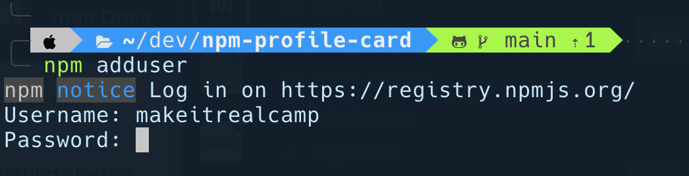

Seguido de esto, nos pedirá la constraseña que usamos para crear la cuenta en [npmjs.org](http://npmjs.org) y un email publico que sera visibl

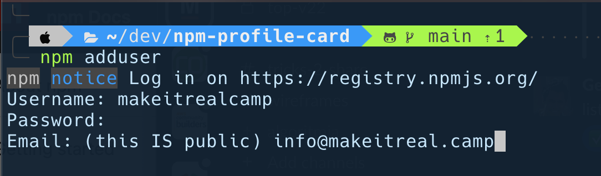

El paso siguiente es ingresar el codigo OTP (one-time password) que es posible llegue al correo con el cual creaste la cuenta en [npmjs.org](http://npmjs.org) si aun no has configurado alguna aplicación Two-factor authentication (2FA).

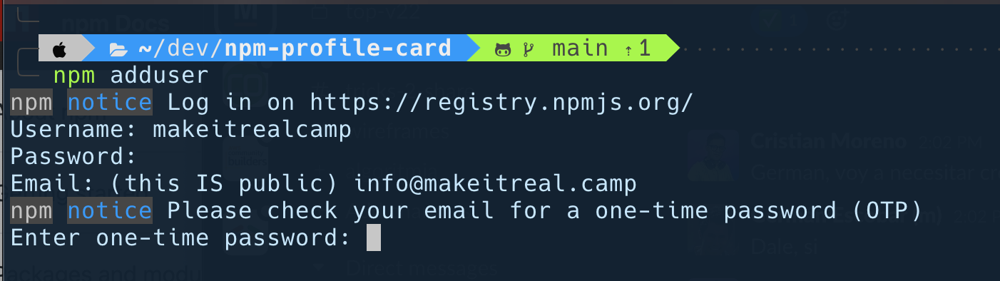

Si todo estos pasos son correctos tendremos la confirmación de un login exitoso. `Logged in as makeitrealcamp on [https://registry.npmjs.org/](https://registry.npmjs.org/)``

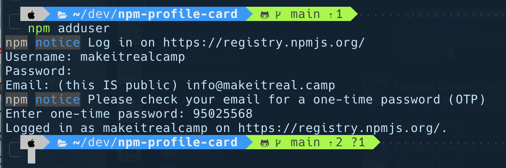

Solo nos falta publicarlo en npm, para eso usaremos el comando:

```bash
npm publish
```

La terminal nos arrojara un registro como el siguiente, lo cual indicara que el paquete ha sido publicado de forma correcta.

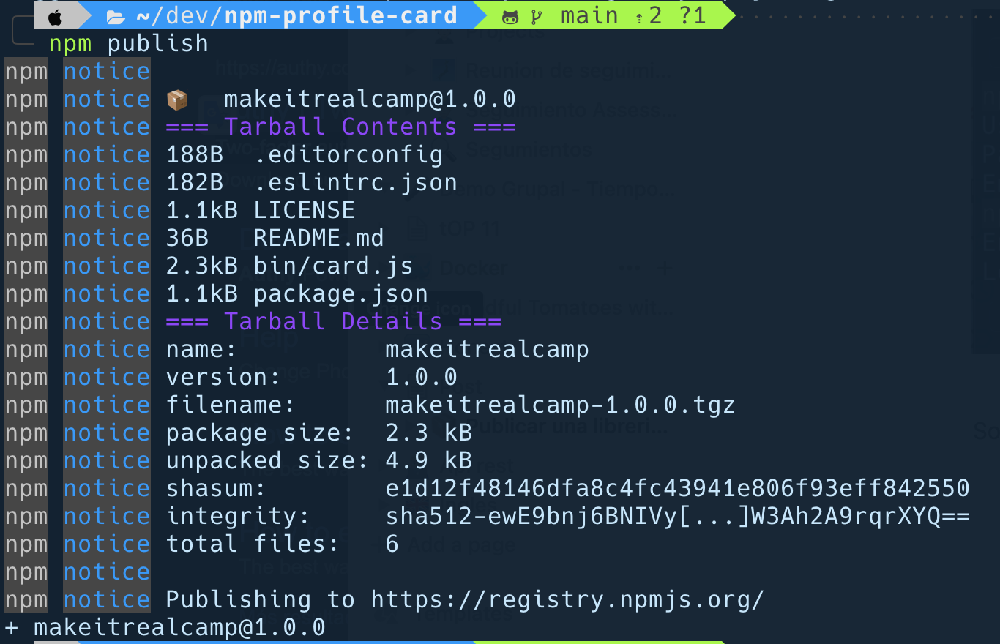

Puedes confirmarlo ingresando la URL: `[https://www.npmjs.com/package/<your_package_name>](https://www.npmjs.com/package/<your_package_name>)` En nuestro caso es [https://www.npmjs.com/package/makeitrealcamp](https://www.npmjs.com/package/makeitrealcamp)

### 7. Actualizar nuestro paquete y publicarlo en npm con `np`

Cuando queremos actualizar nuestro paquete, debemos hacer algunas cosas: extraer lo último de nuestro control remoto de git, actualizar la versión de npm y la etiqueta de git, enviar a nuestro control remoto, enviar etiquetas a nuestro control remoto y luego ejecutar `npm publish`. Uff, eso es mucho. En este punto, configuraremos un script de lanzamiento utilizando el paquete [np](https://github.com/sindresorhus/np) para simplificar este proceso.

Abramos nuestro `package.json` en nuestro editor de código. Vamos a crear un nuevo script. Llamemos a esto el script de `release`. Hagamos que ejecute el paquete np. Guardemos y cerremos este archivo, el paquete np debe estar guardado en nuestras dependencias de desarrollo.

```json
"scripts": {
  ...,
  "release": "np"
}
```

Confirmemos estos cambios en git

```bash
git commit -am "feat: add new script to release"
```

y ahora en vez de ejecutar `npm publish` vamos a ejecutar el script que acabamos de agregar: `npm run release` en la terminal se ejecutara el paquete `np` el cual nos informara que va a publicar una nueva version de nuestro paquete y nos nos preguntara: *"Select semver-increment or specify new version.”* (Hagamos de esto una actualización de parche `patch`. Dice que esto lo va a subir de 1.0 a 1.0.1)


Imagen de referencia.

El paquete comenzara a realizar una serie de tareas necesarias para publicar la actualizacion del paquete.

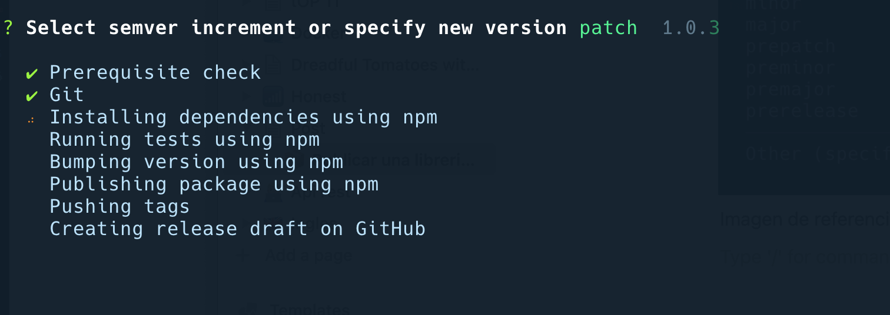

Entre estas tareas, tendremos una muy especial, que sera la de agregar un release en github el cual nos va abrir directamente el navegador en la url de nuestro repositorio para crear el release.

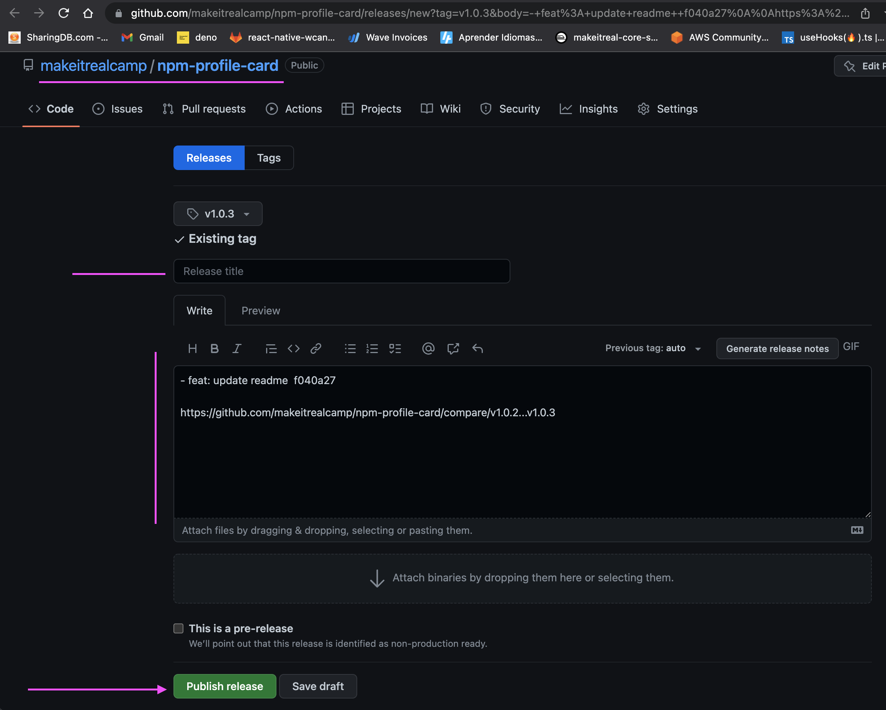

Completa la información de acuerdo a la actualización realizada y luego clic en el botón de `Publish Release` al final de esto tendremos en nuestro repositorio de github un release creado automáticamente, `https://github.com/YOUR_USER_NAME/npm-profile-card/releases/tag/YOUR_VERSION`

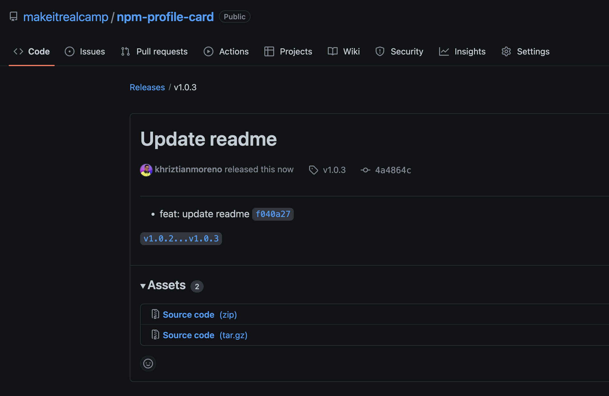

Ademas de tener una nueva version en nuestro perfil de npmjs.org

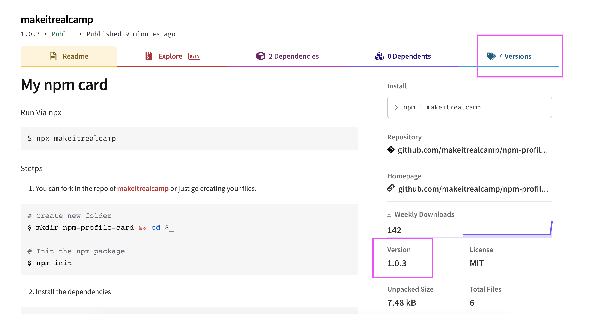

*Imagen de referencia*

Esto es todo por este taller, espero fuera de utilidad para ti.

Te invitamos a compartir por redes sociales, tu primer paquete npm para que el mundo se entere de tus conocimientos.

PD: Si quieres etiquetarnos, nos encantaría 🙈 @makeitrealcamp
- [Twitter](https://twitter.com/makeitrealcamp)
- [Facebook](https://www.facebook.com/makeitrealcamp)
- [Instagram](https://www.instagram.com/makeitrealcamp/)
- [Linkedin](https://www.linkedin.com/school/make-it-real-camp/)

#### Resultados finales referencia

- [Código del proyecto](https://github.com/makeitrealcamp/npm-profile-card)
- [Paquete en npm](https://www.npmjs.com/package/makeitrealcamp)
- Ejecutar paquete npm: `npx makeitrealcamp`
